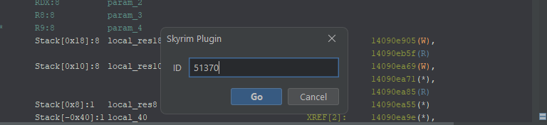
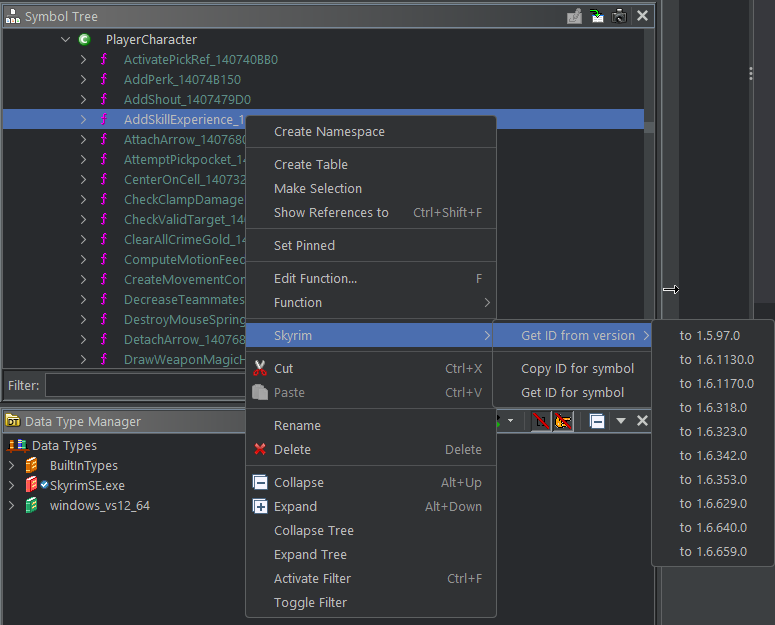
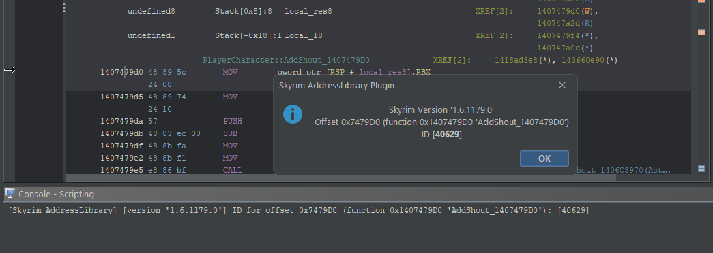
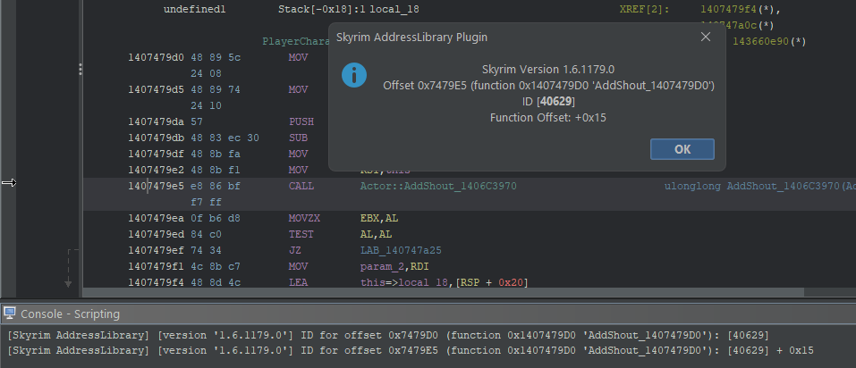
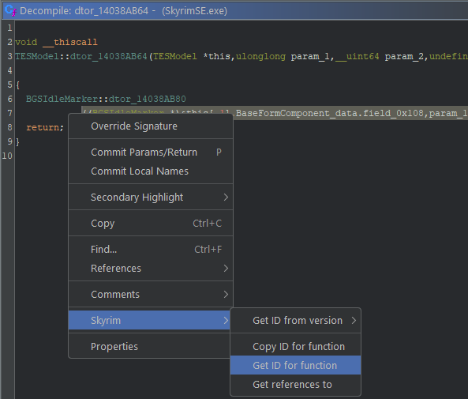

# Ghidra Plugin for Skyrim

Using data from [Address Library](https://www.nexusmods.com/skyrimspecialedition/mods/32444), this plugin provides features to
use the ID's through context menus without the need to run scripts. 

## Games supported

Developed for Skyrim SE, but also supports others. Games supported:

- Skyrim SE
- Starfield
- Fallout 4
- Skyrim VR
- Fallout 4 VR

## Installation

Download the zip, go to File menu, Install Extensions, then click the + at the top right. Be sure to enable the extension.
In CodeBrowser, go to File / Configure, click to configure Misc Plugins and enable the plugin.

## AddressLibrary file formats supported

The formats supported for address library files are:

- .bin SSEv1 (named version-*.bin)
- .bin SSEv2 (named versionlib-*.bin)
- .csv from SkyrimVR and FalloutVR (named version-*.csv)

The files are already inside the data directory of the extension.

## Go To ID

In Navigation menu you can use the "Go to function ID" option to go directly to a function typing its ID.
It is also possible to use the "Go to function offset" for a version different from current binary, the ID will be used to match both versions.
Assign a shortcut to this action by searching "Go to function ID" in "Tool Options / Key Bindings".

## Symbol Tree

You can copy the function ID to clipboard, view the ID in a popup and in the console log (be sure console is opened),
or view the ID and offset for a different version of the game.
To find offset and ID for a different version of the game, the ID from the current binary version is used in the lookup of data for
the other version.

## Listing

In Listing view you can get the ID of the function if you have the cursor over its offset, or you can get the function ID with a
function offset if your cursor is in the middle of the function.

## Decompiler

In Decompiler view you can view or copy the ID of the function right-clicking inside the view.

## Game Version

This plugin tries to detect the game version using PE properties (FileDescription and ProductName for game, and ProductVersion for its version).
If for some reason the binary doesn't have the version properly set in ProductVersion, you can manually set the working game and
version for the plugin using the menu option, in **Tools** / **Skyrim Plugin**. 

## References To

Using the option "Get references to" in the context menu of decompiler view, you can have all the function IDs, names and offsets
that calls the function currently selected.